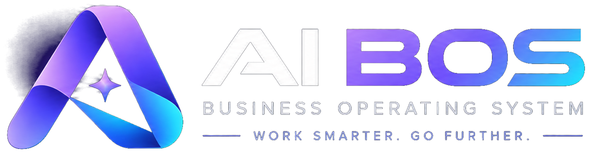
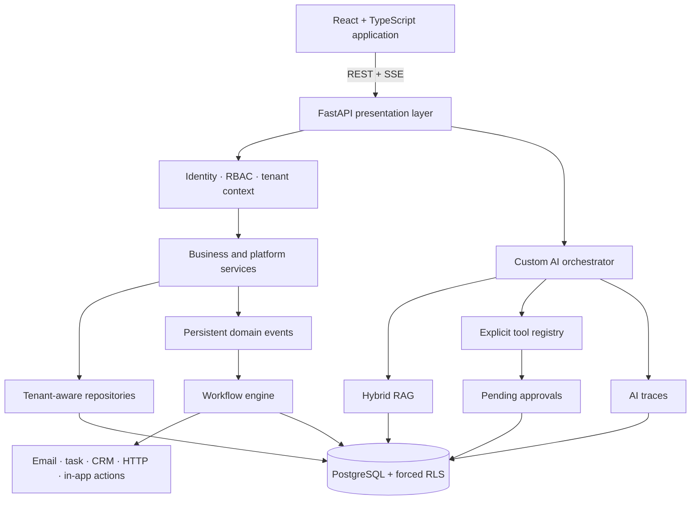
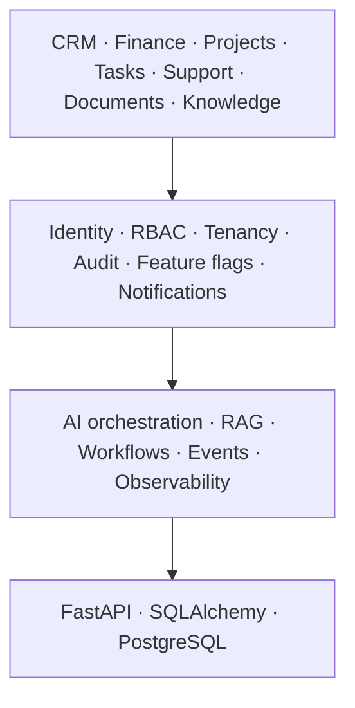
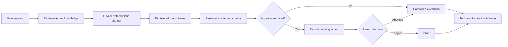
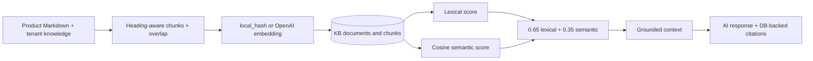
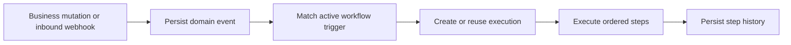
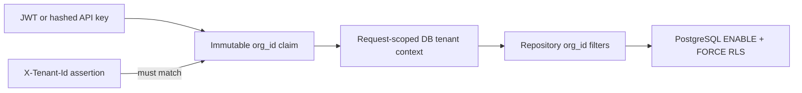

# AI BOS — AI Business Operating System

**An AI-first, multi-tenant business platform that brings operational modules, governed AI tools, database-grounded RAG, and auditable workflow automation behind one FastAPI core.**

[](https://www.python.org/)
[](https://fastapi.tiangolo.com/)
[](https://react.dev/)
[](https://www.typescriptlang.org/)
[](https://www.postgresql.org/)
[](https://www.docker.com/)

<p align="center">
  
</p>

AI BOS is more than a dashboard with an LLM attached. It is a modular SaaS application where business data and AI actions share the same tenant, authorization, workflow, and audit boundaries.

> **Runtime status:** functional full-stack MVP for local and staging-like use. Some integrations and module surfaces remain deliberately partial; see [Current Scope & Known Limitations](#current-scope--known-limitations).

## Why AI BOS?

Business teams often work across disconnected CRM, finance, project, support, knowledge, and automation products. Adding an independent copilot to each silo duplicates identity, permissions, context, observability, and integration logic.

AI BOS explores a platform-level alternative:

- persistence-backed business modules share one identity and tenant model;
- AI receives context through retrieval and an explicit tool registry;
- backend permissions—not the model—decide what can run;
- sensitive AI mutations pause for human approval;
- domain events can trigger workflows with durable execution history;
- operational and AI activity remains traceable by tenant.

## At a Glance

| Area | Current implementation |
|---|---|
| Backend | FastAPI modular monolith with presentation, service, repository, and SQLAlchemy layers |
| Frontend | React 18 + TypeScript + Vite application shell with protected, permission-aware routes |
| Data | PostgreSQL 16 target, Alembic migrations, SQLite-compatible local/test mode |
| Tenant isolation | JWT/API-key `org_id`, request context, repository filters, PostgreSQL forced RLS |
| Authentication | PBKDF2 passwords, JWT access tokens, persistent hashed refresh sessions and rotation |
| AI orchestration | Custom OpenAI tool-calling loop with deterministic local fallback |
| RAG | Markdown ingestion, overlapping chunks, local/OpenAI embeddings, lexical + cosine ranking |
| Workflows | Persisted visual definitions, synchronous event dispatch, controlled action executors |
| Real-time | Database-backed notifications and AI chat streamed over SSE |
| Delivery | Docker, GitHub Actions, Render and Vercel configuration |

## Architecture



The backend is a modular monolith rather than a distributed microservice system. HTTP routes delegate to services and tenant-filtered repositories; SQLAlchemy and Alembic provide persistence and schema evolution.

## Platform Model



The “operating system” positioning refers to this shared platform layer. AI BOS is not a complete accounting ERP, and the repository does not yet contain independently deployable vertical applications.

## Governed AI Copilot

AI BOS uses a custom orchestration path implemented in `agent_orchestrator.py` and `tool_registry.py`. **LangGraph and LangChain are not runtime dependencies.**



The chat endpoint supports up to three planning rounds, OpenAI function calling when configured, deterministic intent planning when it is not, tool-call/result SSE events, RAG sources, and persisted usage traces.

### Key Engineering Decision — AI Reasons, the Platform Authorizes

The model can propose the next tool, but it is not the authorization layer. Execution stays behind:

1. an explicit tool registry and JSON parameter schema;
2. authenticated tenant and user context;
3. backend permission checks;
4. read/write and risk metadata;
5. persisted human approval for gated mutations;
6. repository validation, audit records, and AI traces.

The model has no arbitrary database or shell access.

### AI Tool Registry

| Tool | Purpose | Required access | Execution |
|---|---|---|---|
| `executive_daily_brief` | Cross-module priorities and risks | `dashboard.read` | Read, low risk |
| `cashflow_intelligence` | Explain cash-flow drivers | `finance.invoice.read` | Read, low risk |
| `sales_deal_risk` | Heuristic, explainable deal-risk scoring | `crm.lead.read` | Read, low risk |
| `crm_search_contacts` | Search tenant CRM contacts | `crm.contact.read` | Read, low risk |
| `finance_list_invoices` | List/filter tenant invoices | `finance.invoice.read` | Read, low risk |
| `projects_list` | List tenant projects | `project.read` | Read, low risk |
| `crm_create_lead` | Create a CRM lead | `crm.lead.write` | Mutation, medium risk, approval |
| `tasks_create` | Create an assigned task | `task.write` | Mutation, medium risk, approval |

### Human-in-the-Loop

`crm_create_lead` and `tasks_create` are persisted as pending actions before execution. A rejected action stops; an approved action is re-authorized with the decision-maker's permissions and then executed and audited.

Medium-risk requesters with Copilot access can confirm their own current mutations. The policy code also prevents requester self-approval for future `HIGH` or `CRITICAL` tools, although no registered tool currently uses those levels.

## Hybrid RAG



- `local_hash` provides deterministic, offline 256-dimensional hashing-trick embeddings.
- `openai` calls the configured embeddings endpoint and falls back locally on provider failure.
- checksums avoid re-indexing unchanged documents;
- source metadata and embedding provenance are persisted;
- citations are built from retrieved database chunks, not model-generated URLs;
- retrieved text is explicitly marked as untrusted data in the system prompt and cannot grant permissions or bypass approvals.

The current implementation stores vectors as JSON and calculates cosine similarity in Python. This favors portable local development, not large-corpus search. An indexed backend such as pgvector or Qdrant is a future scaling option—not current runtime.

The retrieval eval covers ten product questions and verifies that returned sources and citations resolve to persisted knowledge records. It does not publish a benchmark score.

## Workflow Automation

Workflow definitions and React Flow graphs are persisted and normalized by the backend. Runs execute a sequence of actions and retain step input/output, status, duration, attempt count, and sanitized errors.



Current executors include configured email, task creation, CRM lead transition, in-app notification, outbound HTTP, and a constrained AI-tool action. Event dispatch is synchronous and in-process.

Repeated delivery with the same `event_id` and workflow ID returns the existing execution instead of creating a duplicate run. This execution-level check is application-side; step idempotency additionally has a database uniqueness constraint.

Outbound HTTP actions enforce HTTP(S), reject credentials in URLs, block local/private/reserved addresses after DNS resolution, disable redirects, cap timeouts and attempts, and retry only network errors, `429`, and `5xx` responses.

Some legacy labels remain partial: “Notifier Slack” currently creates an in-app notification, while finance/PO labels do not create the corresponding financial records.

## Multi-Tenant Isolation



`X-Tenant-Id` cannot switch organizations; it is only a consistency assertion against the authenticated claim. API keys carry their own tenant association.

Alembic applies `ENABLE ROW LEVEL SECURITY` and `FORCE ROW LEVEL SECURITY` to tenant data, with narrow credential-specific pre-authentication policies for exact user, API-key, refresh-session, OAuth, invitation, and Stripe lookups. Platform knowledge may be read globally; control-plane tables such as organizations, plans, feature definitions, password-reset tokens, and Stripe delivery receipts are handled outside tenant RLS.

A dedicated PostgreSQL probe exists. During this audit, direct PostgreSQL checks confirmed isolated tenant reads and rejection of a cross-tenant insert. The pytest wrapper itself currently needs a harness fix described below.

## Authorization

Backend routes use named permissions such as `crm.lead.write`, `finance.invoice.read`, `workflow.write`, and `ai.approval.decide`. The frontend mirrors these checks for route and navigation visibility, while the API remains the enforcement boundary.

Defined roles are `owner`, `admin`, `sales_manager`, `finance_manager`, `hr_manager`, `project_manager`, `staff`, and `viewer`. API keys use explicit non-administrative scopes rather than user roles.

## Security & Trust Boundaries

- PBKDF2-HMAC-SHA256 password hashing with per-password salts;
- signed JWT access and refresh tokens;
- database-backed refresh-token hashes, rotation, family reuse detection, revocation, logout, and logout-all;
- `HttpOnly` refresh cookie; the persisted Zustand slice excludes access and refresh tokens;
- tenant-bound API keys stored as SHA-256 hashes, shown once, scoped, and revocable;
- Google and Microsoft OAuth with state, PKCE, verified provider profiles, and invitation-gated onboarding;
- Stripe signature verification and persisted webhook-event IDs when Stripe is configured;
- rate limits for login, registration, password reset, and AI chat;
- GDPR-oriented JSON export and account-deactivation request flow—without a compliance-certification claim;
- persistent audit records for key mutations;
- structured-log and workflow-history redaction for secret-shaped fields;
- production CORS validation, security headers, and disabled OpenAPI endpoints.

## AI Observability

Tenant-scoped AI traces persist:

- provider and model;
- input/output tokens and estimated cost;
- cumulative latency;
- tools used and final status;
- user, agent, conversation, tenant, and correlation IDs;
- individual planning and response LLM calls.

The Agents UI and API expose trace detail and usage summaries. Cost values are estimates based on a small static pricing table, not provider billing records.

Operational endpoints:

- `GET /health` — process liveness;
- `GET /ready` — database readiness;
- `GET /health/details` — environment, database state, CORS origins, and in-process counters.

Logs are structured JSON with correlation IDs and credential redaction. Metrics are in-process counters; there is no Prometheus exporter or distributed tracing backend in the current repository.

## Business Modules

A page is not treated as proof of a complete capability. The following matrix reflects the current UI → API → repository → database path.

| Maturity | Domains | Current scope |
|---|---|---|
| Persistence-backed | CRM | Contacts CRUD, leads/pipeline, activities |
| Persistence-backed | Finance | Invoices and finance transactions; overview aggregates |
| Persistence-backed | Work management | Projects, tasks, calendar events, meetings |
| Persistence-backed | Operations | Documents/uploads, support tickets/messages, contracts |
| Persistence-backed | Catalog operations | Employees, recruitment, inventory, suppliers, purchase orders |
| Persistence-backed | Platform | Users/orgs, workflows, events/webhooks, notifications, audit, flags, API keys, billing records, AI/RAG records |
| Read-only | CRM activities, contracts, audit log | Persisted records exposed for listing without full write workflows |
| Seed/demo | Finance overview, finance reports, analytics, BI, forecasts | API-backed JSON datasets and deterministic insights; not live analytics or a trained ML platform |
| Partial/derived | Accounting and payments | Transaction-backed or derived views; not a general ledger or payment processor |
| Partial/derived | Payroll, leave, org chart | Employee-backed views and mutations; no dedicated payroll engine |
| Partial | Knowledge and Copilot history | RAG retrieval is persisted; knowledge articles are seeded and chat conversations are not stored |
| Demo-seeded | AI agent catalog and sample business data | Persisted demo records bootstrap the product walkthrough |

## Tech Stack

**AI:** OpenAI-compatible chat/embedding HTTP APIs when configured, custom tool orchestration, deterministic fallback planner, hybrid RAG, SSE.

**Backend:** Python 3.12, FastAPI, Pydantic, SQLAlchemy 2, Alembic, PyJWT, HTTPX.

**Data:** PostgreSQL 16, forced RLS, SQLite test/local compatibility, JSON embedding storage, local or S3-compatible document storage.

**Frontend:** React 18, TypeScript, Vite, React Router, TanStack Query, Zustand, React Hook Form, Zod, Recharts, XYFlow, Framer Motion.

**Platform:** Docker Compose, GitHub Actions, GHCR image builds, Render blueprint, Vercel SPA configuration.

## Repository Structure

```text
ai-business-os/
├── ai-bos-backend/
│   ├── app/                 # FastAPI runtime
│   ├── alembic/             # Database migrations and RLS policies
│   └── tests/               # Backend, RAG, RLS and performance tests
├── ai-bos-frontend/
│   ├── src/                 # React application
│   └── e2e/                 # Playwright scenarios
├── Document/                # Design, runtime notes and roadmap
├── .github/workflows/       # CI and staging image builds
├── docker-compose.dev.yml   # Local PostgreSQL
└── docker-compose.staging.yml
```

The top-level `apps/`, `platform/`, `services/`, and `packages/` directories are mostly future modularization scaffolds; the executable product lives in the backend and frontend directories above.

## Run Locally

### Full staging-like stack

```bash
docker compose -f docker-compose.staging.yml up --build
```

- application: `http://localhost:8080`
- API: `http://localhost:8000`
- health: `http://localhost:8000/health`

The compose defaults are for local staging only. Supply strong secrets through an env file before exposing the stack.

### Development mode

```bash
# Terminal 1 — PostgreSQL on localhost:5433
docker compose -f docker-compose.dev.yml up -d

# Terminal 2 — API
cd ai-bos-backend
python -m pip install -r requirements.txt
alembic upgrade head
python -m uvicorn app.main:app --reload --port 8000

# Terminal 3 — web
cd ai-bos-frontend
npm ci
npm run dev
```

Copy the backend and frontend `.env.example` files to `.env` before starting the services.

## Demo Accounts

> **DEVELOPMENT / DEMO ONLY.** These credentials are intentionally seeded when `SEED_DEMO_DATA=true`. Never enable them in production.

| Persona | Organization | Credentials |
|---|---|---|
| Owner | demo tenant | `ceo@demo.aibos.io` / `demo1234` |
| Staff | demo tenant | `staff@demo.aibos.io` / `demo1234` |
| Owner | second isolation tenant | `ceo@eu.aibos.io` / `demo1234` |

## Configuration

| Group | Important variables |
|---|---|
| Database | `DATABASE_URL`, `DATABASE_POOL_SIZE`, `DATABASE_MAX_OVERFLOW`, `SEED_DEMO_DATA` |
| Authentication | `JWT_SECRET`, `JWT_ALGORITHM`, `ACCESS_TOKEN_EXP_MINUTES`, `REFRESH_TOKEN_EXP_DAYS` |
| AI and RAG | `OPENAI_API_KEY`, `OPENAI_BASE_URL`, `OPENAI_MODEL`, `EMBEDDING_PROVIDER`, `OPENAI_EMBEDDING_MODEL` |
| Browser/API | `CORS_ORIGINS`, `APP_PUBLIC_URL`, `API_PUBLIC_URL`, `CHATBOT_API_TOKEN` |
| OAuth | `GOOGLE_CLIENT_ID`, `GOOGLE_CLIENT_SECRET`, `MICROSOFT_CLIENT_ID`, `MICROSOFT_CLIENT_SECRET` |
| Storage | `STORAGE_LOCAL_PATH`, `S3_ENDPOINT_URL`, `S3_ACCESS_KEY`, `S3_SECRET_KEY`, `S3_BUCKET` |
| Email | `EMAIL_MODE`, `SMTP_HOST`, `SMTP_PORT`, `SMTP_USERNAME`, `SMTP_PASSWORD`, `SMTP_FROM` |
| Billing | `STRIPE_SECRET_KEY`, `STRIPE_WEBHOOK_SECRET`, `ALLOW_UNSIGNED_STRIPE_WEBHOOKS` |
| Workflows | `WORKFLOW_HTTP_ALLOWLIST` |
| Frontend | `VITE_API_URL`, `VITE_USE_MOCKS`, `VITE_AUTO_DEMO_LOGIN`, `VITE_CHATBOT_API_TOKEN` |

Never commit real values. OpenAPI `/docs`, `/redoc`, and `/openapi.json` are disabled when `ENVIRONMENT=production`.

## Testing

Current repository inventory:

- **Backend:** 45 `test_*.py` files; 201 test functions in source, expanded to 215 collected cases by parametrization.
- **Frontend unit:** 4 Vitest files / 16 tests.
- **Browser E2E:** 3 Playwright files / 7 tests.
- **RAG evaluation:** 1 parametrized retrieval/citation evaluation covering 10 questions.
- **Tenant isolation:** application-level tests plus 1 dedicated PostgreSQL RLS probe.
- **Performance:** 2 k6 scenarios and an HTTPX smoke fallback; no throughput claim is made here.

Audit run on **2026-09-07**:

```text
Backend pytest           214 passed, 1 skipped
Frontend typecheck       passed
Frontend Vitest          4 files, 16 passed
Frontend production build passed
Frontend ESLint          0 errors, 7 warnings
Docker Compose config    dev and staging passed
PostgreSQL migrations    001 → 026 passed on PostgreSQL 16
Manual PostgreSQL RLS    tenant reads isolated; cross-tenant write rejected
Playwright E2E            3 passed, 4 failed
```

The skipped default backend test is the PostgreSQL-only RLS probe. When run separately against PostgreSQL, its current pytest harness fails before assertions because the global SQLite test setup installs a `PRAGMA` listener on the PostgreSQL engine. The policies were therefore checked directly during this audit; the harness remains a tracked fix.

The Playwright failures include public/authenticated page timeouts and a mobile-header selector expectation. The versioned brand assets are present and valid; the failures are not reported as passing.

## CI/CD

`.github/workflows/ci.yml` is configured to:

1. install backend dependencies and run pytest on SQLite;
2. migrate a PostgreSQL 16 service with a non-superuser application role;
3. run the dedicated PostgreSQL RLS probe;
4. install frontend dependencies;
5. run TypeScript checks, Vitest, and a production build.

`.github/workflows/cd-staging.yml` builds API and web images, pushes staging and commit-SHA tags to GHCR on main/master, and validates the staging Compose file. It builds artifacts; it does not deploy them to a running environment.

Because of the RLS harness issue found above, the configured PostgreSQL CI step should be treated as currently at risk until fixed and re-run.

## Deployment

The repository configures—but does not prove an active production deployment—to:

- **Vercel** for the React SPA;
- **Render** for the FastAPI service;
- **Neon-compatible PostgreSQL** through `DATABASE_URL`;
- **GHCR** for staging container images.

`render.yaml` disables demo seeding in production, generates the JWT secret, and expects database, CORS, public URL, AI, and SMTP settings to be supplied by the operator.

## Current Scope & Known Limitations

- no LangGraph or LangChain runtime; orchestration is custom;
- vectors are JSON values scored in Python—no pgvector, Qdrant, HNSW, RRF, or cross-encoder reranker;
- changing embedding providers requires re-indexing to avoid incompatible vector dimensions;
- OpenAI is the implemented live LLM path; the Anthropic env field is not connected to a provider implementation;
- event dispatch and workflow execution are synchronous and in-process, without Redis/Kafka workers;
- several catalogued event types have no current API emitter, and execution idempotency has no database-level unique event constraint;
- OAuth state and one-use SPA login codes are process-local, which limits safe horizontal callback scaling;
- notifications are in-app/SSE; “Slack” workflow labels do not call Slack;
- Stripe checkout works when keys and price IDs are configured and otherwise uses a local demo flow;
- local document storage is ephemeral on many PaaS targets unless S3-compatible storage is configured;
- GDPR export covers a selected dataset and the erase request deactivates an account rather than physically deleting tenant data;
- feature-flag administration is implemented, but route-level enforcement is currently limited;
- accounting, payments, payroll, analytics, BI, and forecasting are limited module surfaces, not full specialist systems;
- Copilot conversations are not persisted, and approval executes the tool without resuming an LLM response stream;
- OpenAPI is available outside production but no versioned generated SDK is included;
- metrics are process-local; no Prometheus, OpenTelemetry backend, or distributed pub/sub is configured;
- Kubernetes, multi-region deployment, marketplace verticals, GraphQL, OpenSearch, Airflow, Prophet, Twilio, and Redis are design/roadmap concepts, not this repository's runtime;
- Playwright currently has 4 failing scenarios involving timeouts and a mobile-header selector;
- `npm audit` reported 22 dependency vulnerabilities (3 low, 5 moderate, 14 high) during this audit and requires dependency triage;
- the PostgreSQL RLS pytest harness needs correction even though direct policy checks succeeded.
- `docker-compose.staging.yml` references a missing `.env.staging.example`, and the frontend deployment CSP contains a fixed Render origin.

## Documentation

The `Document/` directory includes both runtime notes and aspirational architecture. Use labels such as `DRAFT`, `DESIGN`, `CONCEPT`, and `ROADMAP` as intended.

- [Production consolidation](Document/README_41_ProductionConsolidation.md) — closest runtime-oriented architecture summary
- [Developer guide](Document/README_37_DeveloperGuide.md) — local engineering workflow
- [Testing](Document/README_30_Testing.md) — test strategy; historical counts may be stale
- [Architecture](Document/README_02_Architecture.md) — design target, not proof of runtime
- [Vision](Document/README_00_Vision.md) — product concept and long-term direction
- [Implementation roadmap](Document/README_40_ImplementationRoadmap.md) — future milestones

## Author

**Sandaniaina Tsinjo Nantosoa**

AI Engineer — RAG · AI Agents · Automation

[tsinjona.netlify.app](https://tsinjona.netlify.app/)

---

AI BOS is an engineering portfolio project and an evolving platform MVP. Evaluate current capabilities from executable code, tests, migrations, and deployment configuration before consulting roadmap documents.
